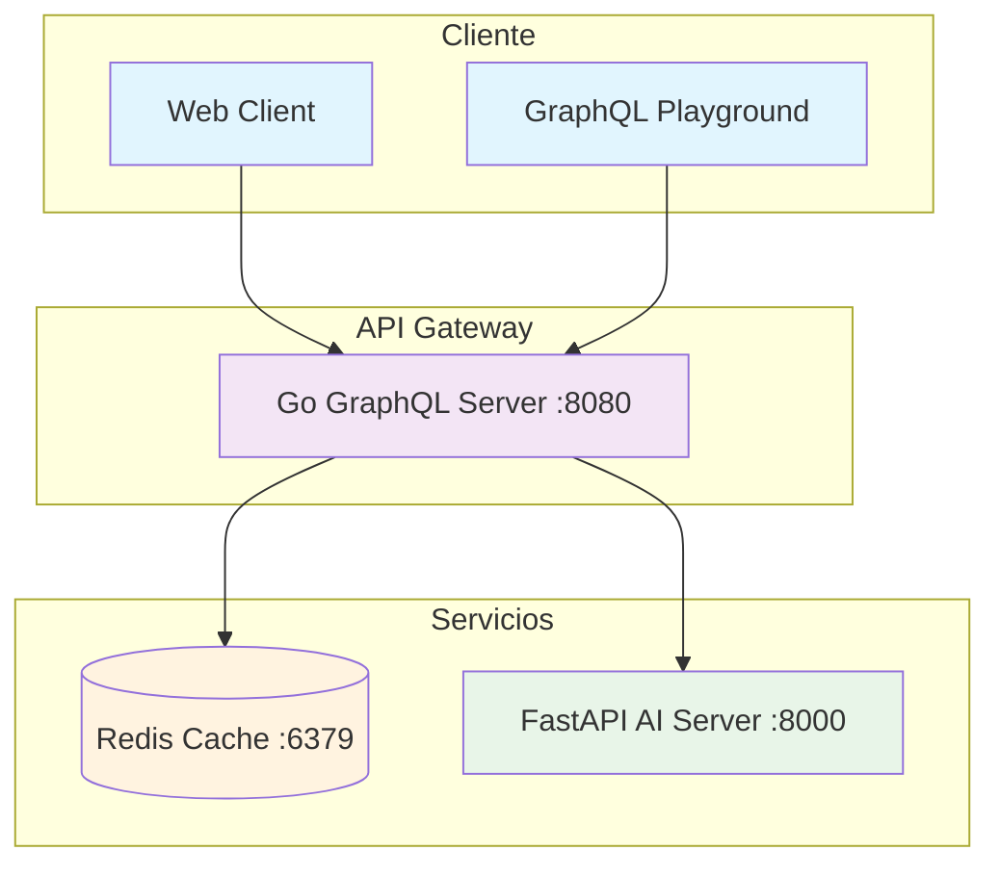
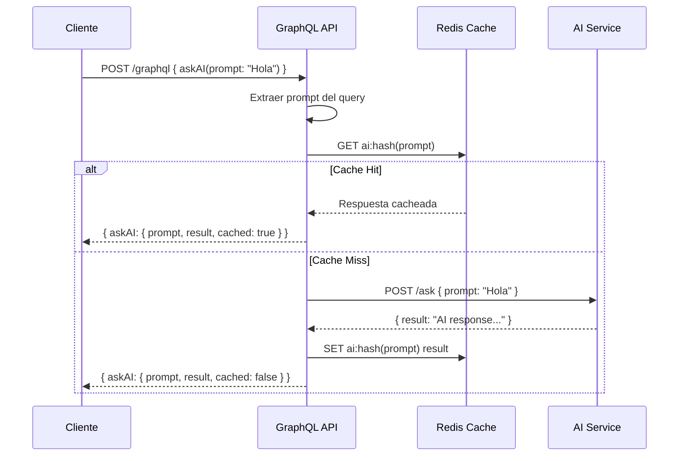
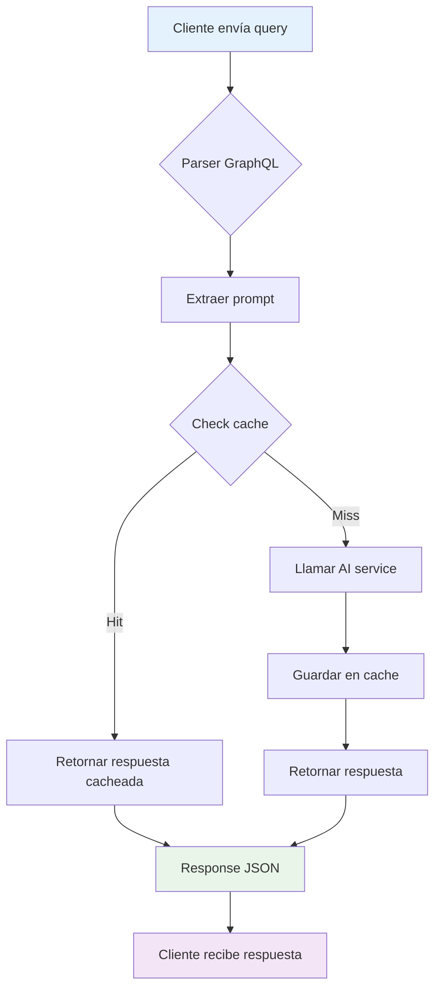

# AI Agent System

Sistema de agente de IA desarrollado con Go + Redis + GraphQL + FastAPI que proporciona una API GraphQL para interactuar con un servicio de IA con caché.

## 🏗️ Arquitectura del Sistema



## 🔄 Flujo de Datos



## 🚀 Funcionalidad Principal

### 1. GraphQL API Server (Go)
- **Endpoint**: `http://localhost:8080/graphql`
- **Playground**: `http://localhost:8080`
- **Schema**: Query `askAI(prompt: String!)` que retorna `AIResponse`

### 2. AI Service (FastAPI)
- **Endpoint**: `http://localhost:8000/ask`
- **Función**: Simula respuestas de IA
- **Response**: `{ "result": "AI response to: {prompt}" }`

### 3. Redis Cache
- **Propósito**: Almacenar respuestas de IA para evitar llamadas repetidas
- **Key Pattern**: `ai:{hash(prompt)}`
- **TTL**: Sin expiración (configurable)

## 🛠️ Tecnologías Utilizadas

| Servicio | Tecnología | Versión | Propósito |
|----------|------------|--------|-----------|
| API Server | Go | 1.25.5 | GraphQL API, servidor principal |
| AI Service | FastAPI | Latest | Microservicio de IA |
| Cache | Redis | 7 | Almacenamiento en caché |
| Container | Docker | Latest | Orquestación de servicios |
| Orchestrator | Docker Compose | Latest | Gestión multi-contenedor |

### Stack Técnico

#### Backend (Go)
- **Framework**: HTTP estándar + parser GraphQL personalizado
- **GraphQL**: Implementación manual con `gqlparser/v2`
- **Cache Client**: `go-redis/v9`
- **HTTP Client**: Para comunicación con AI service

#### Backend (Python)
- **Framework**: FastAPI
- **Servidor**: Uvicorn
- **Modelado**: Pydantic para validación

#### Infraestructura
- **Containerización**: Docker multi-stage builds
- **Networking**: Docker bridge network
- **Orquestación**: Docker Compose

## 📋 Schema GraphQL

```graphql
type Query {
  askAI(prompt: String!): AIResponse!
}

type AIResponse {
  prompt: String!
  result: String!
  cached: Boolean!
}
```

## 🏃‍♂️ Cómo Ejecutar la Aplicación

### Prerrequisitos
- Docker Desktop instalado y corriendo
- Docker Compose (incluido en Docker Desktop)

### Pasos de Ejecución

1. **Clonar el repositorio**
   ```bash
   git clone <repository-url>
   cd AI_Agent_system
   ```

2. **Construir y levantar los servicios**
   ```bash
   docker-compose up -d
   ```

3. **Verificar que los servicios estén corriendo**
   ```bash
   docker-compose ps
   ```
   Deberías ver tres servicios corriendo:
   - `ai_agent_system-api-1` (puerto 8080)
   - `ai_agent_system-redis-1` (puerto 6379)
   - `ai_agent_system-ai-server-1` (puerto 8000)

4. **Acceder a los servicios**
   - **GraphQL Playground**: http://localhost:8080
   - **GraphQL Endpoint**: http://localhost:8080/graphql
   - **AI Service Directo**: http://localhost:8000/ask

## 🧪 Ejemplos de Uso

### Query GraphQL
```graphql
query {
  askAI(prompt: "Hola, cómo estás?") {
    prompt
    result
    cached
  }
}
```

### Response
```json
{
  "data": {
    "askAI": {
      "prompt": "Hola, cómo estás?",
      "result": "AI response to: Hola, cómo estás?",
      "cached": false
    }
  }
}
```

### cURL Example
```bash
curl -X POST http://localhost:8080/graphql \
  -H "Content-Type: application/json" \
  -d '{"query": "{ askAI(prompt: \"Hola\") { prompt result cached } }"}'
```

## 🔧 Desarrollo Local

### Estructura del Proyecto
```
AI_Agent_system/
├── api/                    # Go GraphQL API
│   ├── cmd/server/        # Entry point del servidor
│   ├── graph/             # Lógica GraphQL
│   │   ├── resolver.go    # Resolvers principales
│   │   ├── model/         # Modelos generados
│   │   └── generated/     # Código generado
│   ├── cache/             # Cliente Redis
│   ├── service/           # Cliente AI service
│   └── handler/           # HTTP handlers
├── ai-server/             # FastAPI AI Service
│   ├── main.py           # API FastAPI
│   ├── requirements.txt  # Dependencias Python
│   └── Dockerfile        # Build Python
├── docker-compose.yml     # Orquestación
└── README.md             # Documentación
```

### Construcción Individual
```bash
# Construir API
cd api && docker build -t ai-agent-api .

# Construir AI Server
cd ai-server && docker build -t ai-agent-ai .

# O usando docker-compose
docker-compose build
```

## 📊 Monitoreo y Logs

### Ver logs de todos los servicios
```bash
docker-compose logs -f
```

### Ver logs de un servicio específico
```bash
docker-compose logs -f api
docker-compose logs -f ai-server
docker-compose logs -f redis
```

### Ver estado de los servicios
```bash
docker-compose ps
```

## 🔄 Ciclo de Vida de una Request



## 🚀 Optimizaciones y Mejoras Futuras

### Performance
- [ ] Implementar rate limiting
- [ ] Configurar TTL en Redis
- [ ] Batch processing para múltiples queries
- [ ] Connection pooling optimizado

### Funcionalidad
- [ ] Soporte para mutations
- [ ] Subscriptions GraphQL
- [ ] Autenticación y autorización
- [ ] Logging estructurado

### Infraestructura
- [ ] Kubernetes deployment
- [ ] Health checks mejorados
- [ ] Metrics y monitoring
- [ ] CI/CD pipeline

## 🐛 Troubleshooting

### Problemas Comunes

1. **"transport not supported"**
   - Solución: Usar HTTP POST con Content-Type: application/json

2. **Docker build falla**
   - Verificar que Docker Desktop esté corriendo
   - Limpiar cache: `docker system prune`

3. **Redis connection refused**
   - Verificar que el servicio redis esté corriendo
   - Revisar configuración de red en docker-compose

4. **AI service no responde**
   - Verificar logs: `docker-compose logs ai-server`
   - Confirmar que el puerto 8000 esté disponible

### Comandos Útiles
```bash
# Reiniciar todos los servicios
docker-compose restart

# Detener y limpiar
docker-compose down -v

# Reconstruir desde cero
docker-compose up -d --build --force-recreate

# Verificar conectividad
docker network ls
docker network inspect ai_agent_system_default
```

## 📄 Licencia

MIT License - Ver archivo LICENSE para detalles.

## 🤝 Contribuciones

1. Fork del repositorio
2. Feature branch (`git checkout -b feature/amazing-feature`)
3. Commit changes (`git commit -m 'Add amazing feature'`)
4. Push al branch (`git push origin feature/amazing-feature`)
5. Abrir Pull Request
